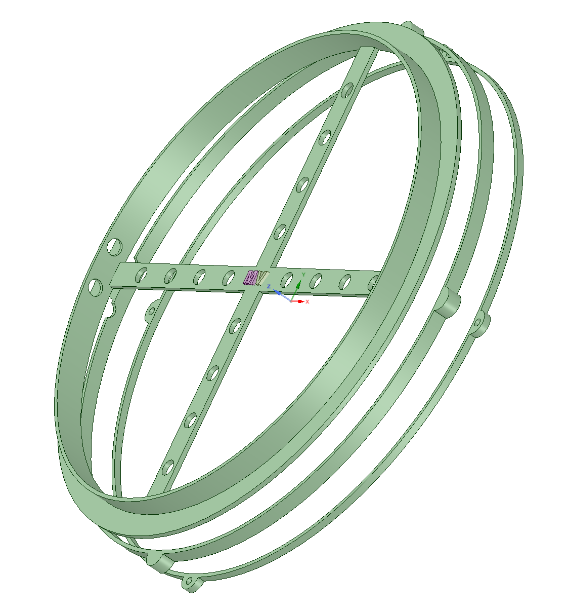

# SousVide

Building a spacer for an 8 liter pot and control software.

The 3D models are spacers to be placed between the bottom of a pot and the lid.
There are a few holes through the spacer for passing temperature sensors.
This way, the lid maintains a full seal around the pot rim.

This is the smaller spacer, the larger spacer was simplified heavily, and 
is no longer split along 3 horizontal planes. 

The larger spacer is split into 3-pieces in order to be printed on a 
printer with a bed with at least 250mm along the longest axis.

