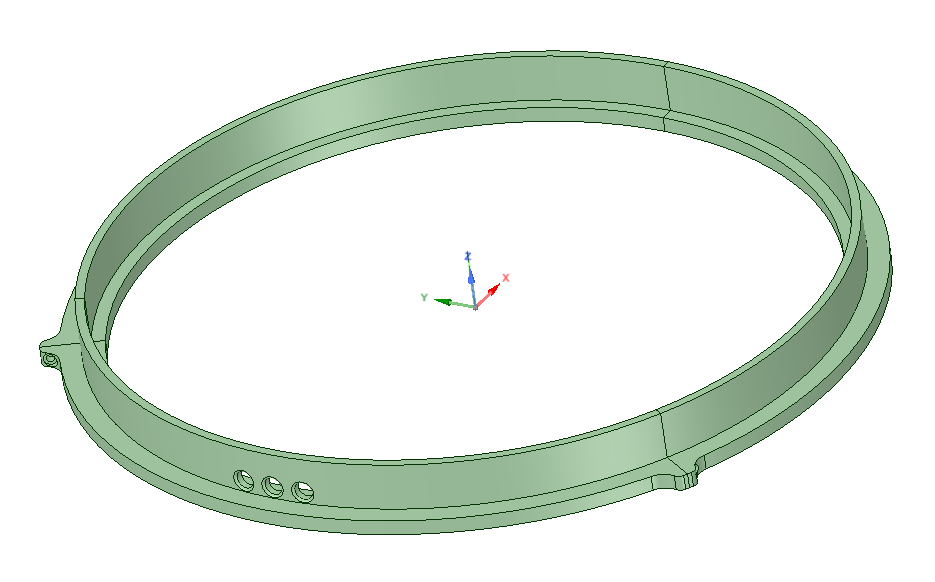

# SousVide

Building a spacer for an 8 liter pot and control software.

The 3D models are spacers to be placed between the bottom of a pot and the lid.
There are a few holes through the spacer for passing temperature sensors.
This way, the lid maintains a full seal around the pot rim.

This is the smaller spacer, it's overly complex and split along horizontal
planes because I wasn't sure whether I could print the base without adding
supports, which I didn't want to do: 

The larger spacer is split into 3-pieces 120 degrees each, in order to be 
printed on a printer with a bed with at least 250mm along the longest axis:

On the bottom of the large spacer, you can see that there are two vertical
supports that extend about 3mm downwards from the bottom surface along 
the inside and outside of the pot wall.

I was concerned about whether the bottom surface would remain level during printing,
but according to [this 3D printing tips page](https://innovationstation.utexas.edu/tip-design), 
the drooping of print material only really starts being an issue when the 
vertical elements are more than 36mm apart.
